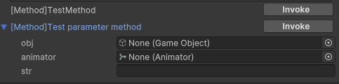
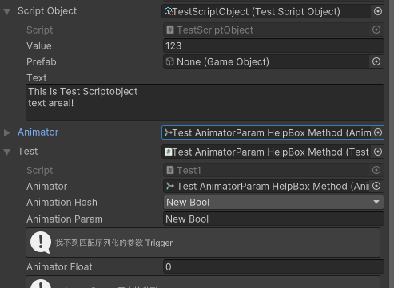
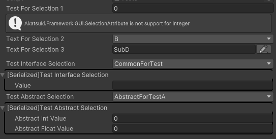

# Akatsuki-Framework-GUI

> Framework of UIElement Drawers

[](https://unity3d.com/get-unity/download) [](https://github.com/Akatsuki-Game/Akatsuki-Framework-GUI/blob/main/LICENSE.md)
Draw inspector elements based on VisualElement

### How to use

* click `Add package from git url ...`
* input path followed
  ```
  https://github.com/Akatsuki-Game/Akatsuki-Framework-GUI.git
  ```

### Attribute List

|          Attribute          |            Desctiption            |
| :--------------------------: | :--------------------------------: |
|       [HelpBox](#HelpBox)       |     Draw a help box down field     |
| [AnimatorParam](#AnimatorParam) |    Popup aniamtor parameter key    |
|        [Method](#Method)        |    Method button with parameter    |
|    [Expendable](#Expendable)    | Expend inspector for unity objects |
|     [Selection](#Selection)     |  Selection popup for const values  |
| [SelectionPath](#SelectionPath) |         Selection for path         |
|      [EnableIf](#EnableIf)      |        Is enabled for field        |

#### HelpBox

```
public class Test : MonoBehaviour {
    [field: HelpBox("this is property", HelpBoxMessageType.Error)]
    [field: SerializeField]
    public int TestPropertyIntValue { get; private set; }
}
```


#### AnimatorParam

```
public class Test : MonoBehaviour {
    public Animator animator;

    [AnimatorParam("animator", AnimatorControllerParameterType.Bool)]
    public int animationHash;

    [AnimatorParam("animator", AnimatorControllerParameterType.Trigger)]
    public string animationParam;

    [AnimatorParam("animator")]
    public float animatorFloat;
}
```


#### Method

```
public class Test : MonoBehaviour {
    [Method]
    public void TestMethod() {
        Debug.Log("this is test method");
    }
  
    // if method have parameters
    // inspector will have framebox style to pack visual elements
    [Method("Test parameter method")]
    public void TestMethod(GameObject obj, Animator animator, string str) {
        Debug.Log($"value1 {obj}, value2 {animator}, value3 {str}");
    }
}
```



#### Expendable

```
public class Test : MonoBehaviour {
    [Expendable]
    public TestScriptObject scriptObject;

    [Expendable]
    public Animator animator;
}
```



#### Selection

```
public class Test : MonoBehaviour {
    [Selection(typeof(CommonForTest))]
    public int testForSelection1;
    [Selection(typeof(CommonForTest))]
    public string textForSelection2;
    [Selection(typeof(CommonForTest.CommonForTestOfSub), true)]
    public string textForSelection3;
}
```



#### SelectionPath

```
public class Test : MonoBehaviour {
    [SelectionPath]
    public int testForPath1;
    [SelectionPath]
    public string testForPath2;
}
```


#### EnableIf

```
public class Test : MonoBehaviour {
    public bool enableForValue1;

    [field: SerializeField]
    public bool EnableForValue2 { get; private set; }

    public bool EnableForValue3() {
        return EnableForValue2;
    }

    [EnableIf(nameof(enableForValue1))]
    [SelectionPath]
    public string value1;

    [EnableIf(ConditionOperator.Or, nameof(enableForValue1), nameof(EnableForValue2))]
    public int value2;

    [HelpBox("For non-param method with bool return")]
    [EnableIf(nameof(EnableForValue3))]
    [Expendable]
    public ScriptableObject value3;
}
```


<!-- #### 
```
public class Test : MonoBehaviour {
  
}
```

 -->

### Reference

- [NaughtyAttributes](https://github.com/dbrizov/NaughtyAttributes)
