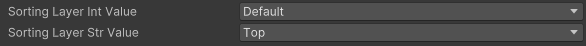
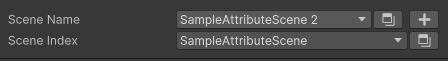

# Akatsuki-Framework-GUI

> Framework of UIElement Drawers

[](https://unity3d.com/get-unity/download) [](https://github.com/Akatsuki-Game/Akatsuki-Framework-GUI/blob/main/LICENSE.md)

Draw inspector elements based on VisualElement

### How to use

* click `Add package from git url ...`
* input path followed
  ```
  https://github.com/Akatsuki-Game/Akatsuki-Framework-GUI.git
  ```

### Attribute List

| Attribute                    | Desctiption                               | State |
| :--------------------------- | :---------------------------------------- | :---- |
| [HelpBox](#HelpBox)             | Draw a help box down field                | ✔️  |
| [AnimatorParam](#AnimatorParam) | Popup aniamtor parameter key              | ✔️  |
| [Method](#Method)               | Method button with parameter              | ✔️  |
| [Expendable](#Expendable)       | Expend inspector for unity objects        | ✔️  |
| [Selection](#Selection)         | Selection popup for const values          | ✔️  |
| [SelectionPath](#SelectionPath) | Selection for path                        | ✔️  |
| SelectionRef                 | Selection for SerializeReference object   | ❌    |
| [EnableIf](#EnableIf)           | Enable or not for field                   | ✔️  |
| [ShowIf](#ShowIf)               | Active or not for field                   | ✔️  |
| [Layer](#Layer)                 | Layer for int / string field value        | ✔️  |
| [SortingLayer](#SortingLayer)   | SortingLayer for int / string field value | ✔️  |
| [Tag](#Tag)                     | Tag for string field value                | ✔️  |
| Drapdown                     | Dropdown for value to select array        | ❌    |
| ProgressBar                  | ProgressBar for slider value              | ❌    |
| ResizableTextArea            | TextArea flex resize area                 | ❌    |
| OnValueChanged               | Valued changed callback                   | ❌    |
| Validator                    | Used for validating the fields            | ❌    |
| Require                      | If empty throw error to remind user       | ❌    |
| [Scene](#Scene)                 | Scene for string value                    | ✔️  |
| [Preview](#Preview)             | Editor preview icon for object            | ✔️  |
| BoxGroup                     | Group for fields                          | ❌    |
| Foldout                      | Foldout for fields                        | ❌    |

#### HelpBox

```
public class Test : MonoBehaviour {
    [field: HelpBox("this is property", HelpBoxMessageType.Error)]
    [field: SerializeField]
    public int TestPropertyIntValue { get; private set; }
}
```


#### AnimatorParam

```
public class Test : MonoBehaviour {
    public Animator animator;

    [AnimatorParam("animator", AnimatorControllerParameterType.Bool)]
    public int animationHash;

    [AnimatorParam("animator", AnimatorControllerParameterType.Trigger)]
    public string animationParam;

    [AnimatorParam("animator")]
    public float animatorFloat;
}
```


#### Method

```
public class Test : MonoBehaviour {
    [Method]
    public void TestMethod() {
        Debug.Log("this is test method");
    }
  
    // if method have parameters
    // inspector will have framebox style to pack visual elements
    [Method("Test parameter method")]
    public void TestMethod(GameObject obj, Animator animator, string str) {
        Debug.Log($"value1 {obj}, value2 {animator}, value3 {str}");
    }
}
```


#### Expendable

```
public class Test : MonoBehaviour {
    [Expendable]
    public TestScriptObject scriptObject;

    [Expendable]
    public Animator animator;
}
```


#### Selection

```
public class Test : MonoBehaviour {
    [Selection(typeof(CommonForTest))]
    public int testForSelection1;
    [Selection(typeof(CommonForTest))]
    public string textForSelection2;
    [Selection(typeof(CommonForTest.CommonForTestOfSub), true)]
    public string textForSelection3;
}
```


#### SelectionPath

```
public class Test : MonoBehaviour {
    [SelectionPath]
    public int testForPath1;
    [SelectionPath]
    public string testForPath2;
}
```


#### EnableIf

```
public class Test : MonoBehaviour {
    public bool enableForValue1;

    [field: SerializeField]
    public bool EnableForValue2 { get; private set; }

    public bool EnableForValue3() {
        return EnableForValue2;
    }

    [EnableIf(nameof(enableForValue1))]
    [SelectionPath]
    public string value1;

    [EnableIf(ConditionOperator.Or, nameof(enableForValue1), nameof(EnableForValue2))]
    public int value2;

    [HelpBox("For non-param method with bool return")]
    [EnableIf(nameof(EnableForValue3))]
    [Expendable]
    public ScriptableObject value3;
}
```


#### ShowIf

```
public class Test : MonoBehaviour {
    public bool showForValue1;

    [field: SerializeField]
    public bool ShowForValue2 { get; private set; }

    public bool ShowForValue3() {
        return ShowForValue2;
    }

    [ShowIf(nameof(showForValue1))]
    [SelectionPath]
    public string value1;

    [ShowIf(ConditionOperator.And, nameof(showForValue1), nameof(ShowForValue2))]
    public int value2;

    [HelpBox("For non-param method with bool return")]
    [ShowIf(nameof(ShowForValue3))]
    [Expendable]
    public ScriptableObject value3;
}
```


#### Layer

```
public class Test : MonoBehaviour {
    [Layer]
    public int layerIntValue;
    [Layer]
    public string layerStrValue;
}
```


#### SortingLayer

```
public class Test : MonoBehaviour {
    [SortingLayer]
    public int sortingLayerIntValue;
    [SortingLayer]
    public string sortingLayerStrValue;
}
```



#### Tag

```
public class Test : MonoBehaviour {
    [Tag]
    public string tagValue;
}
```


#### Scene

```
public class Test : MonoBehaviour {
    [Scene]
    public string sceneName;
    [Scene]
    public int sceneIndex;
}
```



#### Preview

```
public class Test : MonoBehaviour {
    [Preview]
    public Sprite sprite;
    [Preview]
    public TextAsset text;
    [Preview]
    public GameObject prefab;
}
```


<!-- #### 
```
public class Test : MonoBehaviour {
  
}
```

 -->

### Serialized Class List

| Class                | Desctiption                      | State |
| :------------------- | :------------------------------- | :---- |
| SerializedDropdown   | Popup field for dropdown object  | ❌    |
| SerializedDictionary | Serialized for dictionary object | ❌    |
| SerializedDirectory  | Serialized for directory object  | ❌    |

### Reference

- [Unity-SerializeReferenceExtensions](https://github.com/mackysoft/Unity-SerializeReferenceExtensions)
- [NaughtyAttributes](https://github.com/dbrizov/NaughtyAttributes)
- [Tri-Inspector](https://github.com/codewriter-packages/Tri-Inspector)
- [Unity-Editor-Toolbox](https://github.com/arimger/Unity-Editor-Toolbox)
- [Markup-Attributes](https://github.com/gasgiant/Markup-Attributes)
